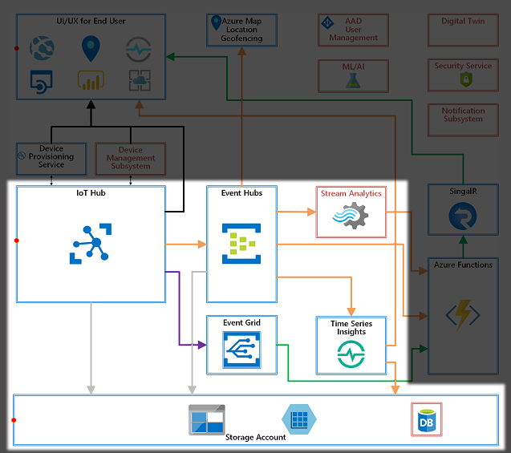
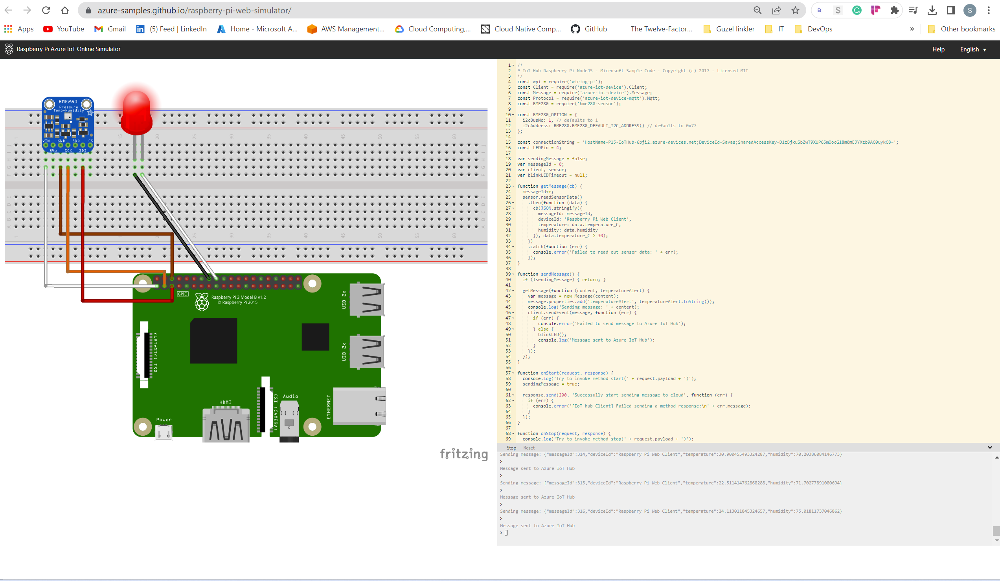

# Azure Things (IoT) technologies with Project 15 Open Platform

## Architecture Overview

The Platform is consist of multiple Azure services and configurations/settings to :

+ Enable Ready to go solution
+ Provision devices using Device Provisioning Service
+ Connect provisioned IoT Devices to IoT Hub
+ Ingest telemetry and events from IoT devices
+ Build a data pipeline necessary for basic telemetry and events processing
+ Visualize IoT devices, telemetry, device events, and device management events in a web site
+ Enable real time visualization using SignalR messaging
+ Store and visualize IoT data using Time Series Insights
+ Enable location based services using Azure Maps
+ Build publish-subscribe model using Event Grid
+ Secure the solution by setting security policies and access controls
+ Exhibit examples of IoT Data visualization and basic device management

## Design Overview
The Platform designed is based on typical IoT use cases. They are divided into following categories

+ IoT Device Management
  Device provisioning and device management
+ IoT data plumbing
  Data ingress and egress
+ Data Pipeline
  Typical data inflow and outflow from key Azure services and to data processing components
+ Data Storage
  Storage for various data types
+ UI+UX
  User interface, interaction, and visualization for end users

### IoT Device Management

Typically IoT device management involves :

+ Provisioning
+ Updates and maintenance
+ Device lifecycle management

Open Platform deploys and configures :

+ Azure IoT Hub
+ Device Provisioning Service (DPS)
+ Event Grid

Open Platform provides examples on :

+ A web site to interact with IoT Hub to perform device management tasks
+ Route device management events from IoT Hub to the web site

### Data Plumbing

Data received from devices must go through several steps to be consumable.

+ Accept data into Cloud through IoT Hub
+ Route data to appropriate destinations
+ Make data available for data processing components
+ These tasks are often referred to as Data Ingestion.

Open Platform deploys and configures :

+ Azure IoT Hub
+ Event Hubs
+ Event Grid

Open Platform provides examples on :

+ Route device data, telemetry and events, for data processing
+ Route device management events

### Data Pipeline

Ingested data must go through processing to be meaningful. Raw data often does not provide more than a fact, but data processing can add value.

Examples of data processing are :

+ Filtering
+ Analyzing
+ Taking actions
+ Modifying or combining

Open Platform deploys and configures :

+ Event Hubs
+ Event Grid
+ Azure Functions
+ Time Series Insights

Open Platform provides examples on :

+ Receiving and processing telemetry data in Azure Functions

### Data Storage

Storage options must be carefully selected, as Azure storage services are often tuned for specific use cases. Typically, selection of storage type depends on frequency of access.

+ Hot storage
Data is frequently accessed on fast storage
+ Warm storage
Data is accessed less frequently than that on Hot Storage
+ Cold storage
Data is rarely accessed on the slow storage

Open Platform deploys and configures :

+ Storage accounts for various Azure services
+ Time Series Insights
+ Endpoints in various services

Open Platform provides examples on :

+ A web site that can visualize IoT telemetry data stored in Time Series Insights

### UX + UI

User experience (UX) is often provided through User Interface (UI). For example a web site to host a dashboard, mobile app to receive notification, or a desktop application to input data.
UI components are highly dependent on UX the solution wants to provide, use cases for the solution, and type of users. Therefore, Open Platform exhibits some of UIs as examples through deploying and configuring a few Azure services.

Open Platform deploys and configures :

+ App Service
+ Web App
+ Azure Functions
+ Azure Maps
+ Time Series Insights
+ SignalR

Open Platform provides examples on :

A web site to :

+ Visualizes telemetry
+ Receive real-time notification
+ Display map

